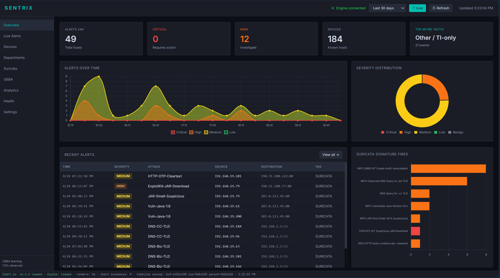
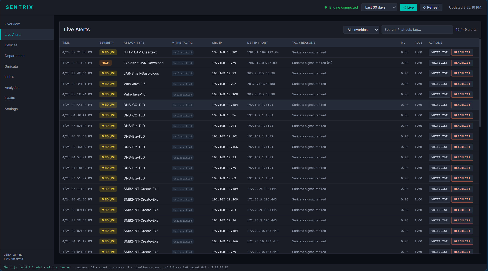
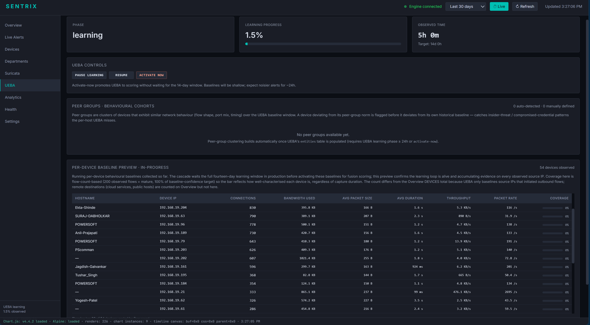
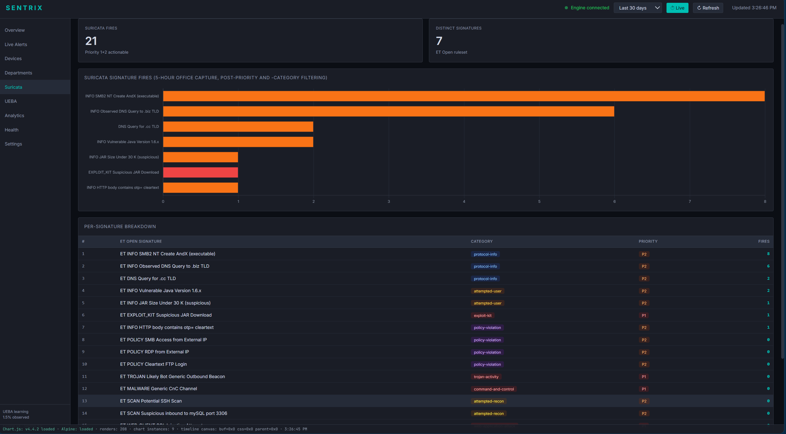

# Sentrix

[](https://github.com/Sohammshheth27/SENTRIX-A-flow-based-intrusion-detection-cascade-with-logit-space-threat-intelligence-fusion/actions/workflows/smoke.yml)
[](LICENSE)
[](https://www.python.org/downloads/)
[](https://onnxruntime.ai/)

A flow-based intrusion detection cascade with logit-space threat-intelligence fusion.

Sentrix observes IPFIX-canonicalised flows from a SPAN tap, runs a five-layer cascade (Layer 0 parallel observation with Zeek + Suricata, Layer 1 IPFIX 53-feature schema, Layer 2 ML cascade with Stage 1 ensemble + Stage 2 18-class typer, Layer 3 seven-signal fusion, Layer 4 alert emission with allowlist and active-learning loop), and surfaces alerts on a live operator dashboard.

## Quick start

```bash
git clone https://github.com/<your>/sentrix.git
cd sentrix
python3 -m venv venv && source venv/bin/activate
pip install -r requirements.txt
python run.py
```

The dashboard comes up at <http://localhost:8080>.

## Dashboard

The operator dashboard surfaces the cascade's post-fusion alert population, per-flow MITRE ATT&CK attribution, per-device behavioural baselines, and the integrated Suricata signature stream.










## Quick start with Docker

The fastest way to bring up the dashboard:

```bash
docker compose up
```

Then open <http://localhost:8080>. The container exposes empty `data/`, `logs/`, and `logs/` directories as volume mounts; drop your input pcaps or replay CSVs into `data/` and the engine will read them.

To run a CSV replay through the cascade (instead of the dashboard-only default):

```bash
docker compose run --rm --service-ports sentrix \
    python run.py --no-browser --mode csv --file /app/data/your_capture.csv
```

## Repository layout

```
sentrix/
├── run.py             Entry point: starts dashboard + realtime engine
├── src/               Live engine, dashboard server, ML cascade, UEBA, fusion
├── models/            Trained ONNX models (5-seed Stage 1 + Stage 2 typer)
├── dashboard/         HTML/CSS/JS frontend
├── config/            Runtime configuration (sanitised; add your own allowlists)
├── scripts/           Operational scripts (start, stop, cron helpers)
├── docs/              Install, runtime, architecture documentation
├── data/              Operator drops input pcaps/parquet here (gitignored)
└── logs/              Runtime engine logs + Zeek conn.log + Suricata eve.json (gitignored)
```

## Per-deployment setup

1. Edit `config/internal_networks.yaml` to declare your private CIDRs.
2. Edit `config/identity_registry.json` to add your devices and departments.
3. Edit `config/whitelist.json` to add your benign IP/port pairs.
4. Edit `config/vlan_config.json` to map VLANs to departments.
5. Run `python scripts/validate_config.py` to verify.
6. Run `python run.py`.

## Documentation

- `docs/INSTALL.md`: full installation walkthrough
- `docs/RUNTIME.md`: runtime operations, alert triage, fine-tuning
- `docs/ARCHITECTURE.md`: cascade architecture summary

## License

MIT. See `LICENSE`.

## Citation

If you use Sentrix in academic work, please cite the companion paper:

```bibtex
@article{shheth2026sentrix,
  title   = {SENTRIX: A flow-based intrusion detection cascade with
             logit-space threat-intelligence fusion},
  author  = {Shheth, Sohamm and Jain, Nilakshi},
  journal = {Intelligent Computing (SPJ)},
  year    = {2026},
  note    = {In submission}
}
```
